# 👨‍💻 Hitesh Sonawane

<div align="center">


[](https://github.com/hvshitesh)
[](https://hvshitesh.netlify.app)
[](https://www.linkedin.com/in/hitesh-sonawane-0a3129257)
[](mailto:hvshitesh29@gmail.com)

</div>

---

## 🚀 About Me

```javascript
const hitesh = {
    location: "BLR, India",
    portfolio: "hvshitesh.netlify.app",
    currentFocus: ["Cloud Engineering", "DevOps", "Microservices"],
    expertise: ["Problem Solving", "System Design", "Web Development"],
    passion: "Building scalable solutions that solve real-world problems",
    motto: "Code, Deploy, Scale, Repeat! 🔄"
};
```

### 🎯 Current Objectives
- 🔭 **Building** cloud-native applications with modern DevOps practices
- 🌱 **Learning** advanced Kubernetes orchestration and microservices architecture  
- 👯 **Collaborating** on open-source projects in cloud and web development
- 🥅 **Goal** - Contributing to enterprise-level cloud infrastructure solutions
- ⚡ **Fun fact** - I name my Docker containers after Marvel characters and my Kubernetes clusters after planets! 🚀🦸‍♂️

---

## 🛠️ Tech Arsenal

<div align="center">

### 💻 Languages & Frontend
<p>


</p>
<p>


</p>

### ⚙️ Backend & Databases
<p>


</p>
<p>


</p>

### ☁️ Cloud & DevOps
<p>


</p>
<p>


</p>

### 📊 Data Science & Monitoring
<p>


</p>
<p>


</p>

</div>

---

## 📊 GitHub Analytics

<div align="center">

<a href="https://github.com/Hvshitesh">
  
  
</a>

</div>

<div align="center">

[](https://github.com/Hvshitesh)

</div>

---

## 🏆 Achievements & Trophies

<div align="center">

[](https://github.com/Hvshitesh)

</div>

---

## 💡 What I'm Working On

```mermaid
graph TD
    A[🚀 Current Projects] --> B[Cloud Architecture]
    A --> C[DevOps Automation]
    A --> D[Full Stack Apps]
    
    B --> E[AWS Solutions]
    B --> F[Microservices]
    
    C --> G[CI/CD Pipelines]
    C --> H[Container Orchestration]
    
    D --> I[React Applications]
    D --> J[API Development]
```

<div align="center">



</div>

---

## 🤝 Let's Connect!

<div align="center">

**I'm always excited to collaborate on innovative projects and discuss emerging technologies!**

[](https://hvshitesh.netlify.app)
[](https://www.linkedin.com/in/hitesh-sonawane-0a3129257)
[](mailto:hvshitesh29@gmail.com)

</div>

---

<div align="center">

### 💭 Quote of the Day
*"The best way to predict the future is to create it."* - Peter Drucker

**⭐ Star my repositories if you find them useful!**


</div>
